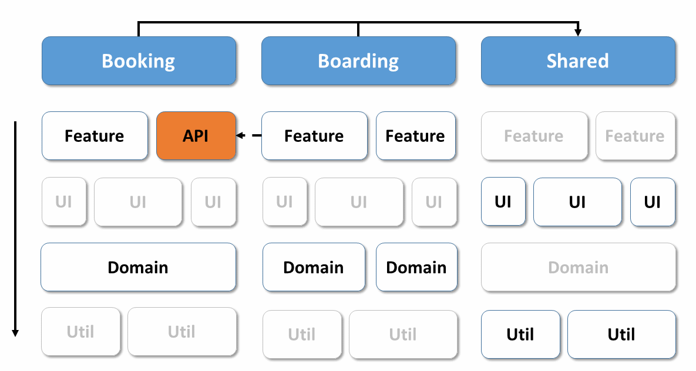

# Domain Driven Design with monorepos in Angular?

**Sustainable Angular Applications with tactical DDD and monorepos**

TLDR; Tactical DDD helps to master the increasing complexity in SPAs and also fits well to the practices found in the Angular world.

In this post you will learn:

- How DDD helps to substructure a big angular application into smaller parts
- How monorepos help implementing them
- How facades help with isolating your domain logic
- How clientside DDD paves the way to micro frontends
  
Business and industrial applications are usually long-lived. A lifetime of one or more decades is not uncommon. In addition, more and more parts of these applications are implemented in the frontend using JavaScript in order to improve usability. 

This raises the question of how proven architecture concepts can be used together with JavaScript frameworks to deal with this situation.

This article provides an answer that has proven itself several times in my practice. It's about using Domain Driven Design in Angular applications and leveraging best practices from both worlds. As I've already written about the use of [Strategic Design](https://www.softwarearchitekt.at/aktuelles/sustainable-angular-architectures-1/) in Angular applications, this article focuses on the other side of the coin: Tactical Design.

As always, the examples used can be found in my [GitHub account](https://github.com/manfredsteyer/angular-ddd).

## Vertical and horizontal dividing lines

Domain Driven Design envisages subdividing an entire system into several small, possibly self-contained subdomains. Each subdomain has to be modeled separately and receives its own entities, which best reflect the respective business area. This approach is also called [Strategic Design](https://www.softwarearchitekt.at/aktuelles/sustainable-angular-architectures-1).

Once these subdomains have been identified, the question arises as to how they should be structured. A classical procedure provides the division into layers. This approach is also pursued by the present text:



As an alternative to layering, a hexagonal architecture or ideas from Clean Architecture can of course also be used. Thanks to the built-in Angular dependency injection mechanism, such implementations are very straightforward.

As shown in the last figure, the approach followed leads to vertical subdivisions into domains and horizontal subdivisions into layers. For those aspects that are to be used across domains, an additional vertical ``shared`` section is used. It corresponds to the Shared Kernel proposed by DDD. In addition, it houses technical libraries, e. g. for authentication or logging.

Each layer now receives one or more libraries. Access rules between these libraries result in loose coupling and thus increased maintainability. Typically, each layer is only allowed to communicate with underlying layers. Also, cross-domain access is allowed only over the ``shared`` area. To prevent too much logic to be put into the ``shared`` area, the approach presented here also uses APIs that publish building blocks for other domains. This corresponds to the idea of ​​Open Services in DDD.

Based on the [eBook of the creators of Nx](https://go.nrwl.io/angular-enterprise-monorepo-patterns-new-book), I distinguish between five categories of layers or libraries:
 

Category | Description | Exemplary content
--------- | ------------ | ---------------------
feature | Contains components for an use case. | book-flight component 
api | Exports building blocks from the current subdomain for others. | flight (from domain layer)
ui | Contains so-called "dumb components" that are use-case agnostic and thus reusable. | datetime-component, address-component, adress-pipe
domain   | Contains those parts of the domain model that are used by the frontend | flight, passenger  
util | Include general utility functions | formatDate

This complete architectural matrix is ​​a bit overwhelming, but as so often, nothing is eaten as hot as it is cooked. As the grayed-out blocks indicate, most ``util`` libraries are in the ``shared`` area, especially as aspects such as authentication or logging are used across systems. The same applies to general UI libraries that ensure a system-wide look and feel.

The use case specific ``feature`` libraries and the domain-specific domain libraries, however, are generally not in the shared area. That would be in the sense of a shared kernel which is one of the ideas of DDD. However, since it can lead to shared responsibilities, more coordination effort, and breaking changes, it should be handled sparingly.

## Isolate the domain

To isolate the domain logic, it is preceded by [Facades](https://medium.com/@thomasburlesonIA/ngrx-facades-better-state-management-82a04b9a1e39). These represent the domain logic for an use case and also handles the management of states:


While facades are currently quite popular in the Angular environment, this idea also correlates wonderfully with DDD, where they are called application services. Also, infrastructure matters are separated from the actual domain logic. In an SPA, they are mostly about communication with the server. This results in three additional layers: the application layer with facades, the actual domain layer and the infrastructure layer.

These layers can now also be packaged in their own libraries. For the sake of simplicity, it is also possible to store them in a single library, which is subdivided accordingly. Especially if these layers are usually used together and only need to be exchanged for unit tests, this decision can make sense.

## Implementation with a monorepo

Once the components of our architecture have been determined, the question arises of how they can be implemented in the world of Angular. A very common approach also used by Google itself is the monorepo. It is a code repository that contains all the libraries of a software system.

Among other things, monorepos simplify the use of shared code, such as the previously discussed shared area, as it no longer needs to be versioned and distributed. Instead, there are always the most recent stable versions of each library in the master branch. 

While a project created with the Angular CLI can nowadays be used as a monorepo, the popular tool [Nx](https://nx.dev/) offers some additional possibilities which are especially valuable for large enterprise solutions. These include the previously discussed ways to introduce [access restrictions between libraries](https://www.softwarearchitekt.at/aktuelles/sustainable-angular-architectures-2/). This prevents each library from accessing each other, resulting in a highly coupled overall system.

In addition, by looking at the git history, Nx can identify which libraries are affected by the latest code changes. This information uses it to recompile only these libraries or just run their tests. Obviously, this saves a lot of time on large systems that are stored in a repository as a whole.

To create a library in a Monorepo, one instruction is enough:

```
generate library domain --directory boarding
```

The switch ``directory`` provided by Nx specifies an optional subdirectory where the libraries are to be put. This way, they can be grouped by the domains of the system:


The names of the libraries reflect the layers. If a layer has several libraries, it makes sense to use these names as a prefix. This results in names such as ``feature-search`` or ``feature-edit``.

In order to isolate the actual domain model, the example shown here divides the domain library into the three further layers mentioned:


# Entities

Tactical Design brings a lot ideas for structuring the domain layer. At the center of this layer, there are entities reflecting the real world domain.  

The following listing shows an enum and two entities that conform to the usual practices of object-oriented languages ​​such as Java or C#.
 

```Java
public enum BoardingStatus {
  WAIT_FOR_BOARDING,
  BOARDED,
  NO_SHOW
}

public class BoardingList {

  private int id;
  private int flightId;
  private List<BoardingListEntry> entries;
  private boolean completed;

  // getters and setters

  public void setStatus (int passengerId, BoardingStatus status) {
    // Complex logic to update status
  }

}

public class BoardingListEntry {

  private int id;
  private boarding status status;

  // getters and setters
}
```

As usual in object orientation, these entities use information hiding to ensure that their state remains consistent. You implement this with private fields and public methods that operate on them.
 
In addition, these entities not only encapsulate data, but also business rules. At least the method ``setStatus`` indicates this circumstance. Only for cases where business rules can not be meaningfully accommodated in an entity, DDD defines so-called domain services.

Entities that only represent data structures are frowned upon in DDD. The community calls them devaluing [bloodless (anemic)](https://martinfowler.com/bliki/AnemicDomainModel.html).

From an object-oriented point of view, this may be correct. However, with languages ​​such as JavaScript and TypeScript, object orientation is less important. Rather, they are multi paradigm languages ​​in which functional programming is particularly important.
 
However, since functional programming propagates the separation of data structures and logic, domain models are compulsorily bloodless. Works dealing with functional DDD, like [this](https://pragprog.com/book/swdddf/domain-modeling-made-functional) or [that](https://www.amzn.com/1617292249), emphasize this and even [Domain-Driven Design Distilled](https://www.amzn.com/0134434420), one of the standard works for DDD which primarily relying on OOP, admits that this rule change is necessary in the world of FP. The previously considered entity model would therefore be separated in TypeScript into a data part and a logic part:


```Typescript
export type BoardingStatus = 'WAIT_FOR_BOARDING' | 'BOARDED' | 'NO_SHOW' ;

export interface BoardingList {
    readonly id: number;
    readonly flightId: number;
    readonly entries: BoardingListEntry [];
    readonly completed: boolean;
}

export interface BoardingListEntry {
    readonly passengerId: number;
    readonly status: BoardingStatus;
}
```

```Typescript
export function updateBoardingStatus (
                   boardingList: BoardingList,
                   passengerId: number,
                   status: BoardingStatus): Promise <BoardingList> {

        // Complex logic to update status

}
```
 

Here the entities also use public properties. This too is quite common in FP, while the excessive use of getters and setters, which only delegate to private properties, is often ridiculed - other paradigms, other customs!

Now, of course, there is a lot to argue about what the better style is. Much more interesting, however, is the question of how the functional world avoids inconsistent states. The answer is amazingly simple: data structures are preferably immutable. The keyword ``readonly`` in the example shown emphasizes this.

A part of the program that wants to change such objects has to clone it, and if other parts of the program have first validated an object for their own purposes, they can assume that it remains valid.


## Aggregates

To keep track of the components of a domain model, Tactical DDD combines entities into aggregates. In the last example, ``BoardingList`` and ``BoardingListEntry`` form such an aggregate.
 
The state of all components of an aggregate must be consistent as a whole. For example, in the example outlined above, one could specify that ``completed`` in `` BoardingList`` may only be set to ``true`` if no ``BoardingListEntry`` has the status `` WAIT_FOR_BOARDING`` .

In addition, different aggregates may not reference each other through object references. Instead, they can use IDs. This should prevent unnecessary coupling between aggregates. Large domains can thus be broken down into smaller groups of aggregates.

[Domain Driven Design Distilled](https://www.amzn.com/0134434420) suggests making aggregates as small as possible. First of all, consider each entity as an aggregate and then merge aggregates that need to be changed together without delay.


## Facades aka Application Services

The task of the Application Services is to represent details of the domain model for specific use cases. This idea has been very popular in the world of Angular independent of DDD for some time. This is also referred to as [facades](https://go.nrwl.io/angular-enterprise-monorepo-patterns-new-book):
 

```typescript
@Injectable ({providedIn: 'root'})
export class FlightFacade {

    private flightsSubject = new BehaviorSubject<Flight[]>([]);
    public flights$ = this.flightsSubject.asObservable();

    constructor (private flightService: FlightService) {
    }

    search (from: string, to: string, urgent: boolean): void {

        this.flightService.find(from, to, urgent).subscribe (
            flights => {
                this.flightsSubject.next (flights)
            },
            err => {
                console.error ('err', err);
            }
        );
    }
}
```

While it is a good practice to make server-side services stateless, this does not apply to services in SPAs. A SPA has state and that's what makes it user-friendly: You do not want to get all the information from the server over and over again.

This circumstance also reflects the considered facade by keeping the retrieved flights for later use within the use case. For this, it uses observables. This means that the facade can inform Angular but also other system components when conditions change.

Also, the facades allow to introduce Redux and ``@ngrx/store`` later when needed. For the consumer of the facade it is not relevant whether it manages the state by it self or by delegating to a state management library.

## Domain Events

Besides performance improvements, using Observables provide a further advantage: They allow further decoupling, since the sender and the receiver do not have to know each other directly.

This also perfectly fits to DDD, where the use of domain events is nowadays part of the agenda too: If something interesting happens in one part of the application, it sends a domain event and other application parts can react to it. In the shown example, a domain event could indicate that a passenger is now BOARDED. If this is interesting for other parts of the system they can execute specific logics. 

## Domain Driven Design and Micro Frontends?

The ideas of Domain Driven Design are known to pave the way for micro-service architectures. Hence, client-side DDD can be used as a basis for micro frontends.

Whether a deployment monolith, micro frontends, or anything in between is created, depends on the use of the monorepo. If the monorepo gets an own application for each domain, a big step towards micro frontends is taken:


The access restrictions discussed above ensure a loose coupling and even allow a later split to multiple repositories, if this is considered to be beneficial for decoupling. Then you can talk about micro frontends in the classic sense of a micro-service architecture. However, in this case the team has to take care of versioning and distributing shared libraries which is common with micro-services.

## Conclusion

Modern single page applications are often more than just recipients of data transfer objects. They contain a lot of logic and that adds complexity. Ideas from DDD help to master the resulting complexity.

Due to the object-functional nature of TypeScript and prevailing customs, a few rule changes are necessary.

The use of monorepos with multiple libraries grouped by domains helps building the basic structure and access restrictions between libraries prevent coupling between domains. Facades prepare the domain model for individual use cases and take care of maintaining the state. If needed, Redux can be used behind the facade without the rest of the application noticing. 

Besides, a team also creates the conditions for micro frontends by using client-side DDD.

 

 