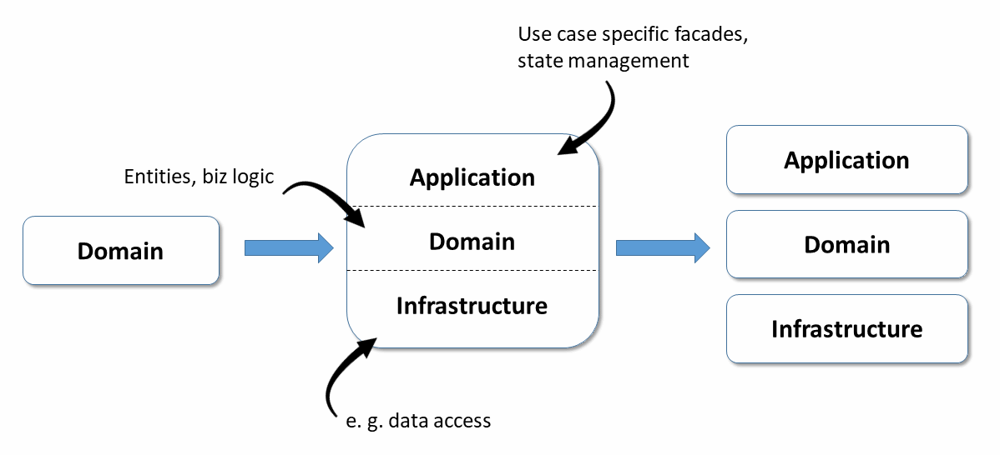
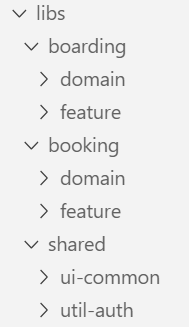
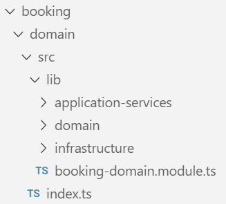
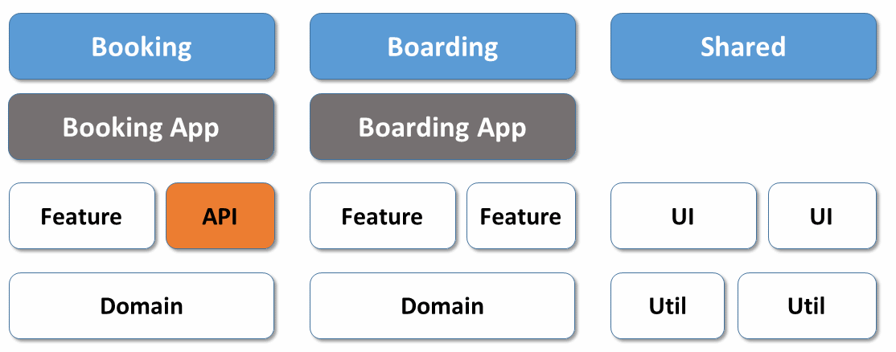

# Domain-Driven Design + MonoRepos?

## Introduction

Business and industrial applications are usually long-lived. These applications include customer-facing applications layered with complex backend services and systems. Many of these applications are now implemented with web frontends using JavaScript. So how can we build and maintain complex, layered software systems with modern Javascript/Typescript frameworks?

> Big thanks to [Thomas Burleson](https://twitter.com/ThomasBurleson) who deeply reviewed this article.

## Domains in Software Architectures

Before we explore Domain-driven design (DDD), we should first discuss what we mean by the term [Domains](https://en.wikipedia.org/wiki/Domain_(software_engineering). A **domain** is an software term that comprises terminology, requirements, functionality, and relationships with a specific software area.

> You will probably agree that ^ was way too abstract! 😨

Let's consider a software application for a consumer travellers: TravelAgent. We have several domains that we can easily define. 


Each domain (Reservations, Crew, Flights) will have business requirements and source code for models, interfaces, data services, UI, state management, etc. 


As the quantity of domains and the complexity of each domain increases, we struggle to keep a clean, understandable, scalable architecture. 

## Why Domain-Driven Design (DDD)

**Question:** So how can we manage complexity in an applicaiton with many domains?
**Answer:** We should leverage Domain-Driven Design and best practices from the Angular community. 

I've already written about the use of **[Strategic Design](https://www.softwarearchitekt.at/aktuelles/sustainable-angular-architectures-1/)** in Angular applications. Domain-driven design recommends subdividing an entire system into several small, possibly self-contained subdomains.

Each subdomain should be modeled separately and receives its own Entities, which best reflect the respective business area. Once these subdomains have been identified, the question arises as to how they should be structured and organized 


**Tactical Design**, however, helps us master the increasing complexity in SPAs with clear code organization and specific constructs useful to encapsulate and hide complexity. Best of all, Tactical DDD is especially suitable for complex Angular solutions.


## **Tactical Domain-Driven Design**

this post you will learn:

- How **DDD** helps to organize our application source code as smaller, manageable, coherent parts.
- How **MonoRepos** help implementing them
- How **Facades** help with isolating your domain logic
- How client-side DDD paves the way to micro frontends

As always, the examples used can be found in my [GitHub account](https://github.com/manfredsteyer/angular-ddd).

----

## Organization by Domain with Layers

As shown illustration below, our modeling approach leads to column (aka swimlanes) for Domains and row subdivisions for our Layers of functionality. 


Each layer now consists one (1) or more **libraries**. For those aspects that are to be *shared* and used across domains, an additional swimlane ``shared`` section is used. For example, the shared domains may comprise 1 or libraries of code. e. g. for authentication or logging.

>  Note: the `shared` column corresponds to the Shared Kernel proposed by DDD and also includes technical libraries to share.

Access rules between these libraries result in loose coupling and thus increased maintainability. Typically, each layer is only allowed to communicate with underlying layers. Also, cross-domain access is allowed only over the ``shared`` area. To prevent too much logic to be put into the ``shared`` area, the approach presented here also uses APIs that publish building blocks for other domains. This corresponds to the idea of Open Services in DDD.

While using layers is a quite traditional approach, there are also alternatives like hexagonal architectures or clean architectures. Regardless of using layers or other ides, in general we have to subdivide our system into subdomains and find ways to structure them.

Regarding the shared part, one can see the following two characteristics:

*  As the grayed-out blocks indicate, most ``util`` libraries are in the ``shared`` area, especially as aspects such as authentication or logging are used across systems. The same applies to general UI libraries that ensure a system-wide look and feel.
* UI features contained in the `shared` library are usually global UI, custom UI component libraries, etc.

The use case specific ``feature`` libraries and the domain-specific domain libraries, however, are not in the shared area. 

> Feature related code should be placed within its domain. Sharing such code can lead to shared responsibilities, more coordination effort, and breaking changes. Hence, it should only be shared sparingly.

## Organization by Packages

Based on Nrwl.io's [Enterprise MonoRepository Patterns](https://go.nrwl.io/angular-enterprise-monorepo-patterns-new-book), I distinguish between five (5) categories of layers or libraries:

Category | Description | Exemplary content
--------- | ------------ | ---------------------
feature | Contains components for an use case. | book-flight component 
ui | Contains so-called "dumb components" that are use-case agnostic and thus reusable. | datetime-component, address-component, adress-pipe
api | Exports building blocks from the current subdomain for others. | flight (from domain layer)
domain   | Contains the **domain models** (classes, interfaces, types) that are used by the domain (swimlane)
util | Include general utility functions | formatDate

This complete architectural matrix is initially overwhelming. But after review, almost all developers I've consulted agreed that the code organization facilitates code reuse and future features. 


## Isolate the Domain

To isolate the domain logic, one should consider issues of state management and push-based architectures. Two (2) excellent articles are available for deep dives into those areas:

* [Ngrx + Facades: Better State Management](https://medium.com/@thomasburlesonIA/ngrx-facades-better-state-management-82a04b9a1e39)
* [Push-based Archtectures with RxJS](https://medium.com/@thomasburlesonIA/push-based-architectures-with-rxjs-81b327d7c32d)

>  These approaches - which encapsulate domain logic and manages changes to state - leverage the concepts of Facades.



While facades are currently quite popular in the Angular environment, this idea also correlates wonderfully with DDD (where they are called application services). 

It is also important to architecturally separate *infrastructure requirements* from the actual domain logic. 

In an SPA, infrastructure concerns are -- at least most of the time -- asynchnronous communication with the server and data exchanges. Maintaining this separation results in three additional layers: 

* the api layer with facades, 
* the actual domain layer, and 
* the infrastructure layer.

Of course, these layers can now also be packaged in their own libraries. For the sake of simplicity, it is also possible to store them in a single library, which is subdivided accordingly. This decision to use a single grouping library makes senses if these layers are usually used together [and only need to be exchanged for unit tests].

### Implementation with a monorepo

Once the components of our architecture have been determined, the question arises of how they can be implemented in the world of Angular. A very common approach also used by Google itself is the monorepo. It is a code repository that contains all the libraries of a software system.

Among other things, monorepos simplify the use of shared code, such as the previously discussed shared area, as it no longer needs to be versioned and distributed. Instead, there are always the most recent stable versions of each library in the master branch. 

While a project created with the Angular CLI can nowadays be used as a monorepo, the popular tool [Nx](https://nx.dev/) offers some additional possibilities which are especially valuable for large enterprise solutions. These include the previously discussed ways to introduce [access restrictions between libraries](https://www.softwarearchitekt.at/aktuelles/sustainable-angular-architectures-2/). This prevents each library from accessing each other, resulting in a highly coupled overall system.

In addition, by looking at the git commit log, Nx can identify which libraries are affected by the latest code changes. This change information is used to recompile only the **affected** libraries or just run their **affected** tests. Obviously, this saves a lot of time on large systems that are stored in a repository as a whole.

To create a library in a Monorepo, one instruction is enough:

```
generate library domain --directory boarding
```

The switch ``directory`` provided by Nx specifies an optional subdirectory where the libraries are to be put. This way, they can be grouped by the domains of the system:



The names of the libraries reflect the layers. If a layer has several libraries, it makes sense to use these names as a prefix. This results in names such as ``feature-search`` or ``feature-edit``.

In order to isolate the actual domain model, the example shown here divides the domain library into the three further layers mentioned:



----

### Tactial Design + Entities

Tactical Design provides many ideas for structuring the domain layer. At the center of this layer, there are **entities** reflecting the real world domain.  

The following listing shows an enum and two entities that conform to the usual practices of object-oriented languages such as Java or C#.
 

```Java
public enum BoardingStatus {
  WAIT_FOR_BOARDING,
  BOARDED,
  NO_SHOW
}

public class BoardingList {

  private int id;
  private int flightId;
  private List<BoardingListEntry> entries;
  private boolean completed;

  // getters and setters

  public void setStatus (int passengerId, BoardingStatus status) {
    // Complex logic to update status
  }

}

public class BoardingListEntry {

  private int id;
  private boarding status status;

  // getters and setters
}
```

As usual in object orientation, these entities use information hiding to ensure that their state remains consistent. You implement this with private fields and public methods that operate on them.
 
In addition, these entities not only encapsulate data, but also business rules. At least the method ``setStatus`` indicates this circumstance. Only for cases where business rules can not be meaningfully accommodated in an entity, DDD defines so-called domain services.

Entities that only represent data structures are frowned upon in DDD. The community calls them devaluing [bloodless (anemic)](https://martinfowler.com/bliki/AnemicDomainModel.html).

From an object-oriented point of view, this may be correct. However, with languages such as JavaScript and TypeScript, object orientation is less important. Rather, they are multi-paradigm languages in which functional programming is particularly important.
 
Works dealing with functional DDD can be reviewed here:

* [Domain Modeling Made Funcitonal](https://pragprog.com/book/swdddf/domain-modeling-made-functional),
* [Functional and Reactive Domain Modeling](https://www.amzn.com/1617292249).

With functional programming, the previously considered entity model would therefore be separated in TypeScript into a data part and a logic part:


```Typescript
export type BoardingStatus = 'WAIT_FOR_BOARDING' | 'BOARDED' | 'NO_SHOW' ;

export interface BoardingList {
    readonly id: number;
    readonly flightId: number;
    readonly entries: BoardingListEntry [];
    readonly completed: boolean;
}

export interface BoardingListEntry {
    readonly passengerId: number;
    readonly status: BoardingStatus;
}
```

```Typescript
export function updateBoardingStatus (
                   boardingList: BoardingList,
                   passengerId: number,
                   status: BoardingStatus): Promise <BoardingList> {

        // Complex logic to update status

}
```
 
> Also [Domain-Driven Design Distilled](https://www.amzn.com/0134434420) which is one of the standard works for DDD and primarily relies on OOP, admits that this rule change is necessary in the world of FP.

Here the entities also use public properties. This too is quite common in FP

> Note: with FP the excessive use of getters and setters, which only delegate to private properties, is often ridiculed!

Now, of course, there is a lot to argue about what the better style is. 

Much more interesting, however, is the question of how the functional world avoids inconsistent states. The answer is amazingly simple: data structures are preferably **immutable**. The keyword ``readonly`` in the example shown emphasizes this.

A part of the program that wants to change such objects has to clone it, and if other parts of the program have first validated an object for their own purposes, they can assume that it remains valid.

> A wonderful side-affect of using immutable data structures is that change detection performance is optimized. No longer are *deep-comparisons* required. Instead a *changed* object is actually a new instance and thus the object references will no longer be the same.

### Tactial Design + Aggregates

To keep track of the components of a domain model, Tactical DDD combines entities into aggregates. In the last example, ``BoardingList`` and ``BoardingListEntry`` form such an aggregate.
 
The state of all components of an aggregate must be consistent as a whole. For example, in the example outlined above, one could specify that ``completed`` in `` BoardingList`` may only be set to ``true`` if no ``BoardingListEntry`` has the status `` WAIT_FOR_BOARDING`` .

In addition, different aggregates may not reference each other through object references. Instead, they can use IDs. This should prevent unnecessary coupling between aggregates. Large domains can thus be broken down into smaller groups of aggregates.

[Domain-Driven Design Distilled](https://www.amzn.com/0134434420) suggests making aggregates as small as possible. First of all, consider each entity as an aggregate and then merge aggregates that need to be changed together without delay.


## Facades aka Application Services

The task of the Application Services is to represent details of the domain model for specific use cases. Independent of DDD, this idea has been very popular in the world of Angular for some time. 

This is also referred to as **[facades](https://go.nrwl.io/angular-enterprise-monorepo-patterns-new-book)**:
 

```typescript
@Injectable ({providedIn: 'root'})
export class FlightFacade {

    private flightsSubject = new BehaviorSubject<Flight[]>([]);
    public flights$ = this.flightsSubject.asObservable();

    constructor (private flightService: FlightService) {
    }

    search (from: string, to: string, urgent: boolean): void {

        this.flightService.find(from, to, urgent).subscribe (
            flights => {
                this.flightsSubject.next (flights)
            },
            err => {
                console.error ('err', err);
            }
        );
        
        return this.flights$;
    }
}
```

While it is a good practice to make server-side services stateless, this does not apply to services in SPAs. A SPA has state and that's what makes it user-friendly. To avoid UX issues, Angular applications do not want to reload all the information from the server over and over again.

Optimizing data loads is also supported in the Facade by keeping the retrieved flights for later use. For this, it uses observables. This means that the Facade can auto-deliver updated flight information when conditions change.

Another advantage of Facades is the ability to transparently introduce Redux and ``@ngrx/store`` later when needed. This can be done without affecting any of the external application components. 

> For the consumer of the facade it is not relevant whether it manages the state by it self or by delegating to a state management library.

----

## Domain Events

Besides performance improvements, using Observables provide a further advantage. Observables allow further decoupling, since the sender and the receiver do not have to know each other directly. 

This also perfectly fits to DDD, where the use of **domain events** are now part of the architecture. If something interesting happens in one part of the application, it sends a domain event and other application parts can react to it. 

In the shown example, a domain event could indicate that a passenger is now BOARDED. If this is interesting for other parts of the system they can execute specific logics. 

> For Angular developers familiar with Redux or Ngrx, domain events can be represented as *dispatched actions*!

## Domain-Driven Design and Micro Frontends?

The ideas of Domain-Driven Design are known to pave the way for micro-service architectures. Hence, client-side DDD can be used as a basis for micro frontends.

Whether a deployment monolith, micro frontends, or anything in between is created, depends on the use of the monorepo. If the monorepo gets an own application for each domain, a big step towards micro frontends is taken:



The access restrictions discussed above ensure a loose coupling and even allow a later split to multiple repositories. Then you can talk about micro frontends in the classic sense of a micro-service architecture. However, in this case the team has to take care of versioning and distributing shared libraries which is common with micro-services.

## Conclusion

Modern single page applications (SPAs) are often more than just recipients of data transfer objects (DTOs). They contain often contain significant domain logic; which adds complexity. Ideas from DDD help developers manage and scale with the resulting complexity.

Due to the object-functional nature of TypeScript and prevailing customs, a few rule changes are necessary. The implementation outlined here bases upon the following ideas:

* The use of monorepos with multiple libraries grouped by domains helps building the basic structure and access restrictions between libraries prevent coupling between domains. 
* Facades prepare the domain model for individual use cases and take care of maintaining the state. 
* If needed, Redux can be used behind the facade without the rest of the application noticing. 

Besides, a team also creates the conditions for micro frontends by using client-side DDD.

 

 
